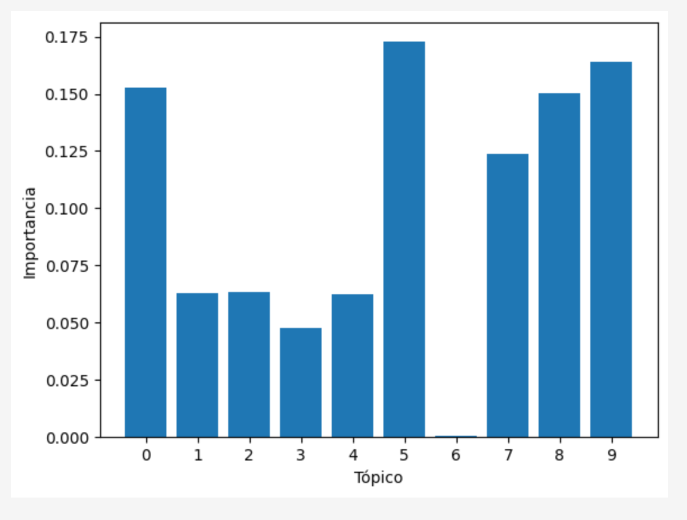

# Reporte de Datos

Este documento contiene los resultados del análisis exploratorio de datos.

## Resumen general de los datos

Los documentos se obtienen de una página web de intermediarios de una compañía de seguros. 
Son 18 documentos que se encuentran en formato PDF. En promedio cada documento tiene 2 MB de tamaño para un total de 36 MB.
Los documentos se encuentran en español y corresponden a procedimientos de una empresa de seguros.

## Resumen de calidad de los datos

En esta sección se presenta un resumen de la calidad de los datos. Se describe la cantidad y porcentaje de valores faltantes, valores extremos, errores y duplicados. También se muestran las acciones tomadas para abordar estos problemas.

La gráfica muestra la importancia promedio de cada tema (tópico) a lo largo de los documentos analizados en el modelo LDA, se puede observar que los temas 0, 5, 8 y 9 parecen ser los más importantes en el corpus, ya que tienen las barras más altas. Esto significa que son los temas predominantes en los documentos.

Por otra parte las nubes permiten identificar rápidamente los conceptos que dominan en cada tema y su relación con el corpus general. Dado esto, palabras como cliente, vehículo, y poliza, tópicos 0, 5 y 8 respectivamente son los más importantes, confirmando el tema trabajado.
Adicionalmente, se puede observar el tópico 2 contiene temas de botones y links que es posible borrar para entrenar el modelo dado que no representan un valor para el.

## Conclusión

- Se puede concluir la validez de los archivos puesto que los tópicos más relevantes de las nubes de palabras son compatibles con el tema de seguros de autos. 
- Aunque se eliminaron las stop word, se ve pertinente realizar la eliminacion de palabras no relevantes como botón, clic e información, puesto que pueden deberse a extras por links dentro de los archivos y no suponen información importante.

