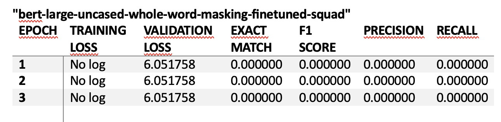
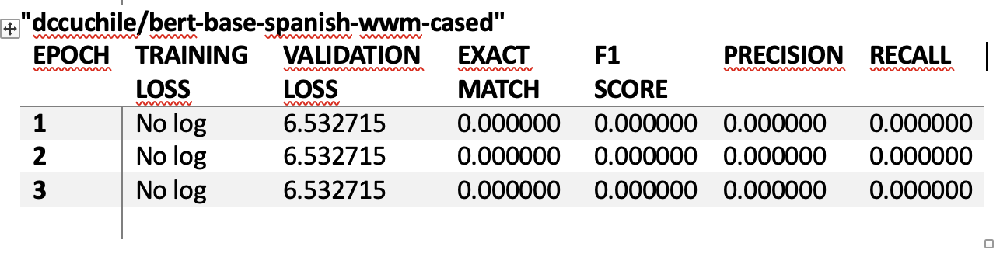

# Reporte del Modelo Baseline

Este documento contiene los resultados del modelo baseline.

## Descripción del modelo

### bert-large-uncased-whole-word-masking-finetuned-squad

Este modelo es una versión grande de BERT (Bidirectional Encoder Representations from Transformers) preentrenado en texto en inglés en minúsculas utilizando la técnica de Whole Word Masking y afinado en el conjunto de datos SQuAD (Stanford Question Answering Dataset).

Características:	
Capas: 24
Dimensión oculta: 1024
Cabezas de atención: 16
Parámetros: 336 millones
Objetivo de preentrenamiento: Modelado de lenguaje enmascarado (MLM) y predicción de la siguiente oración (NSP)
Uso principal: Respuesta a preguntas en inglés2.
Pertenece a: Google
Referencia en Hugging Face

### dccuchile/bert-base-spanish-wwm-cased

BETO es una versión en español del modelo BERT, entrenado en un gran corpus en español utilizando la técnica de Whole Word Masking. Está disponible en versiones cased (sensible a mayúsculas) y uncased (no sensible a mayúsculas).

Características:
Tamaño: Similar a BERT-Base
Vocabulario: Aproximadamente 31k subpalabras BPE construidas usando SentencePiece
Pasos de entrenamiento: 2 millones
Uso principal: Tareas de procesamiento de lenguaje natural en español, como clasificación de secuencias y etiquetado de entidades.
Pertenece a: DCC UChile
Referencia en Hugging Face

### deepset/xlm-roberta-large-squad2

Descripción: Este modelo es una versión grande de XLM-RoBERTa, un modelo multilingüe preentrenado en múltiples idiomas y afinado en el conjunto de datos SQuAD 2.0 para tareas de Preguntas y Respuestas extractivas.

Características:
Modelo base: xlm-roberta-large
Idiomas: Multilingüe
Tarea: Preguntas y Respuestas extractivas
Datos de entrenamiento: SQuAD 2.0
Hiperparámetros: Tamaño de lote = 32, épocas = 3, longitud máxima de secuencia = 256, tasa de aprendizaje = 1e-5.
Pertenece a: deepset
Referencia en Hugging Face

### deepset/roberta-large-squad2

Descripción: Este modelo es una versión grande de RoBERTa, afinada utilizando el conjunto de datos SQuAD 2.0. Está entrenado en pares de preguntas y respuestas, incluyendo preguntas sin respuesta.

Características:
Modelo base: roberta-large
Idioma: inglés
Tarea: Preguntas y Respuestas extractivas
Datos de entrenamiento: SQuAD 2.0
Hiperparámetros: Tamaño de lote = 32, épocas = 3, longitud máxima de secuencia = 256, tasa de aprendizaje = 1e-5.
Pertenece a: deepset
Referencia en Hugging Face

## Variables de entrada

La variable de entrada del modelo es el corpus de los archivos PDF, en este caso 1 archivo para que el modelo no fuera demasiado pesado.
Este es un modelo de Preguntas y Respuestas que utiliza un modelo de generación de texto, afinado con el conjunto de datos SQuAD 2.0. 

## Variable objetivo

Por ser un proyecto de análisis no supervisado no tiene variable objetivo.

## Evaluación del modelo

### Métricas de evaluación

Se utilizaron las siguientes métricas de evaluación:

- Validation Loss (Pérdida de Validación):  Mide cuán bien el modelo se ajusta a los datos de validación. Ayuda a evaluar si el modelo está aprendiendo correctamente y no está sobreajustando los datos de entrenamiento. Utilizada en modelos de aprendizaje supervisado, especialmente en redes neuronales y modelos de aprendizaje profundo.

- Exact Match (EM): Mide el porcentaje de respuestas que coinciden exactamente con la respuesta correcta. Evalúa la precisión de un modelo de Preguntas y Respuestas. Comúnmente utilizada en modelos de Preguntas y Respuestas extractivas.

- F1 Score: Combina la precisión y la exhaustividad en una sola puntuación. Proporciona una medida equilibrada del rendimiento del modelo, especialmente útil cuando hay un desequilibrio entre clases. Utilizada en clasificación binaria y multiclase, así como en modelos de Preguntas y Respuestas.

- Precision (Precisión): Mide el porcentaje de respuestas correctas entre todas las respuestas proporcionadas por el modelo. Evalúa la exactitud de las predicciones del modelo. Utilizada en clasificación binaria y multiclase, así como en modelos de Preguntas y Respuestas.

- Recall (Exhaustividad): Mide el porcentaje de respuestas correctas entre todas las respuestas posibles. Evalúa la capacidad del modelo para encontrar todas las respuestas correctas. Utilizada en clasificación binaria y multiclase, así como en modelos de Preguntas y Respuestas.

### Resultados de evaluación
bert-large-uncased-whole-word-masking-finetuned-squad

dccuchile/bert-base-spanish-wwm-cased

deepset/xlm-roberta-large-squad2

deepset/roberta-large-squad2

## Análisis de los resultados

El modelo "deepset/roberta-large-squad2" tiene una pérdida de validación más baja (0.785217) en comparación con "deepset/xlm-roberta-large-squad2" (1.975281), lo que indica que se ajusta mejor a los datos de validación.

Exact Match y F1 Score: "deepset/roberta-large-squad2" tiene una puntuación perfecta en Exact Match y F1 Score (1.000000), lo que significa que proporciona respuestas precisas y equilibradas.

Precision y Recall: Ambos son perfectos (1.000000) para "deepset/roberta-large-squad2", lo que indica que el modelo encuentra todas las respuestas correctas y todas las respuestas proporcionadas son correctas.

En resumen, "deepset/roberta-large-squad2" parece ser el mejor modelo en términos de rendimiento basado en las métricas proporcionadas. 

## Referencias

Hugging Face Transformers: Transformers Documentation
SQuAD Dataset: (Stanford Question Answering Dataset)

Utilizamos modelos pre-entrenados de Hugging Face:

"bert-large-uncased-whole-word-masking-finetuned-squad"
Este modelo es una versión grande de BERT (Bidirectional Encoder Representations from Transformers)
Pertenece a: Google

"dccuchile/bert-base-spanish-wwm-cased"

BETO es una versión en español del modelo BERT.
Pertenece a: DCC UChile

"deepset/xlm-roberta-large-squad2"
Este modelo es una versión grande de XLM-RoBERTa, un modelo multilingüe preentrenado en múltiples idiomas.
Pertenece a: deepset

"deepset/roberta-large-squad2"

Este modelo es una versión grande de RoBERTa, afinada utilizando el conjunto de datos SQuAD 2.0. 
Pertenece a: deepset

