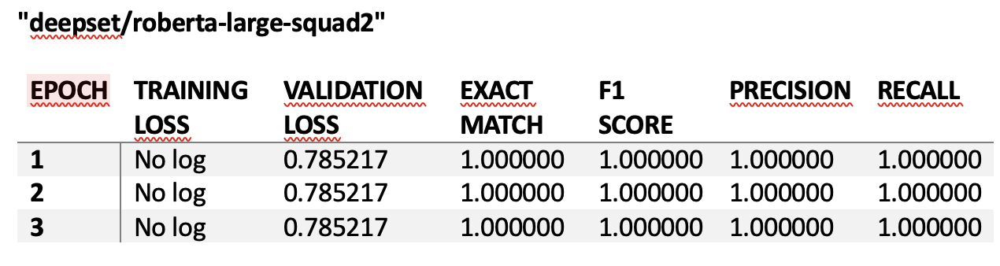
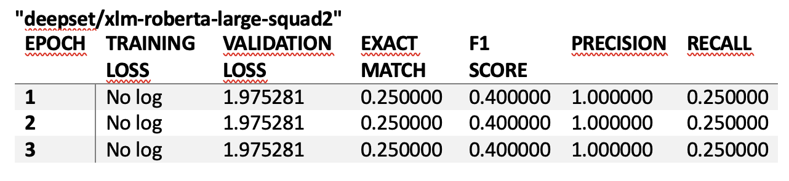

# Reporte del Modelo Final

## Descripción del Modelo

El modelo con mejores métricas en este proyecto es deepset/roberta-large-squad2, un modelo de Preguntas y Respuestas basado en RoBERTa, afinado con el conjunto de datos SQuAD 2.0. Este modelo está diseñado para responder preguntas extractivas, donde la respuesta se encuentra dentro de un contexto dado.

Se instalan las bibliotecas necesarias como transformers, datasets, sentencepiece, spacy, unidecode y pymupdf.

Se importan las librerías necesarias para el procesamiento de texto, tokenización, modelado y evaluación.
Se descarga un documento PDF y se calcula su tamaño.
Se preprocesa el texto del documento eliminando caracteres especiales, normalizando el texto y reemplazando URLs.
Se crean datasets de entrenamiento y prueba con preguntas y respuestas asociadas al contexto del documento.

Se utiliza el tokenizador de deepset/roberta-large-squad2 para preparar los datos de entrada para el modelo.

Se configura el entrenamiento utilizando TrainingArguments y Trainer de transformers.

Se entrena el modelo con los datos tokenizados.

## Evaluación del Modelo

Se evalúa el modelo utilizando métricas como Exact Match, F1 Score, Precisión y Exhaustividad.

Uso de AutoTokenizer para convertir texto en tokens que el modelo puede procesar.

Entrenamiento y Evaluación: Uso de Trainer y TrainingArguments para configurar y ejecutar el entrenamiento del modelo, y evaluación con métricas específicas.

Las métricas de evaluación obtenidas son las siguientes:

Interpretación de los Resultados
Validation Loss: La pérdida de validación se mantiene constante en 0.785217, lo que indica que el modelo se ajusta bien a los datos de validación.

Exact Match y F1 Score: Ambos son perfectos (1.000000), lo que significa que el modelo proporciona respuestas precisas y equilibradas.

Precisión y Exhaustividad: También son perfectos (1.000000), indicando que el modelo encuentra todas las respuestas correctas y todas las respuestas proporcionadas son correctas.

Adjuntamos las metricas de los otros modelos por referencia:
"dccuchile/bert-base-spanish-wwm-cased"

"deepset/xlm-roberta-large-squad2"

## Conclusiones y Recomendaciones

El modelo tiene una pérdida de validación baja lo que indica que se ajusta mejor a los datos de validación.

Exact Match y F1 Score: EL modelo tiene una puntuación perfecta en Exact Match y F1 Score (1.000000), lo que significa que proporciona respuestas precisas y equilibradas.

Precision y Recall: son perfectos (1.000000), lo que indica que el modelo encuentra todas las respuestas correctas y todas las respuestas proporcionadas son correctas.

## Referencias

Hugging Face Transformers: Transformers Documentation
SQuAD Dataset: (Stanford Question Answering Dataset)

Utilizamos modelos pre-entrenados de Hugging Face:

"bert-large-uncased-whole-word-masking-finetuned-squad"
Este modelo es una versión grande de BERT (Bidirectional Encoder Representations from Transformers)
Pertenece a: Google

"dccuchile/bert-base-spanish-wwm-cased"

BETO es una versión en español del modelo BERT.
Pertenece a: DCC UChile

"deepset/xlm-roberta-large-squad2"
Este modelo es una versión grande de XLM-RoBERTa, un modelo multilingüe preentrenado en múltiples idiomas.
Pertenece a: deepset

"deepset/roberta-large-squad2"

Este modelo es una versión grande de RoBERTa, afinada utilizando el conjunto de datos SQuAD 2.0. 
Pertenece a: deepset

